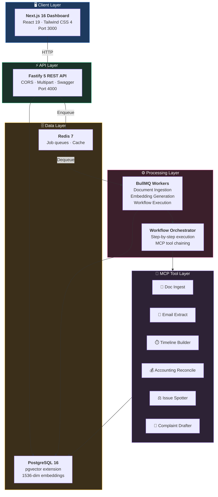
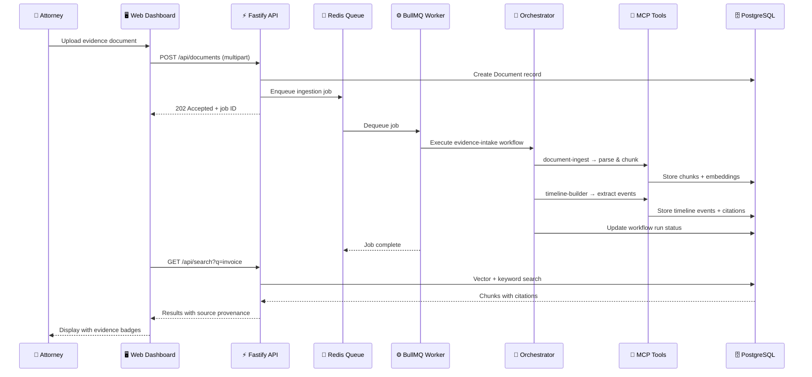
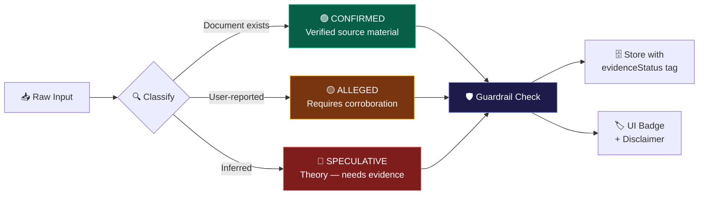
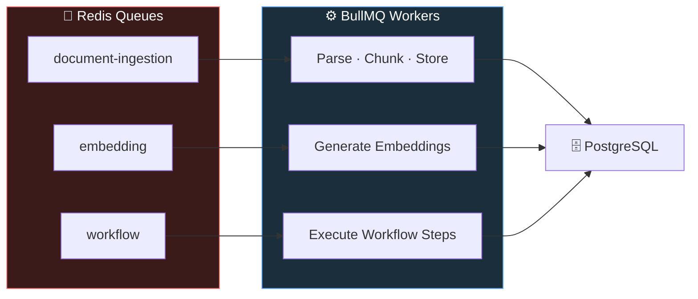
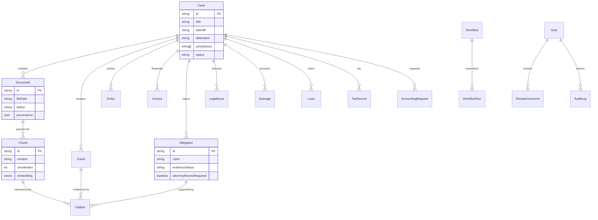
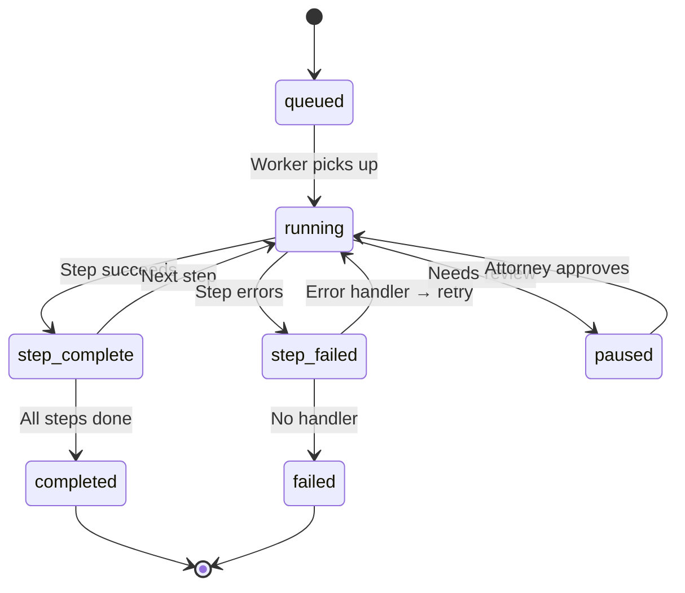
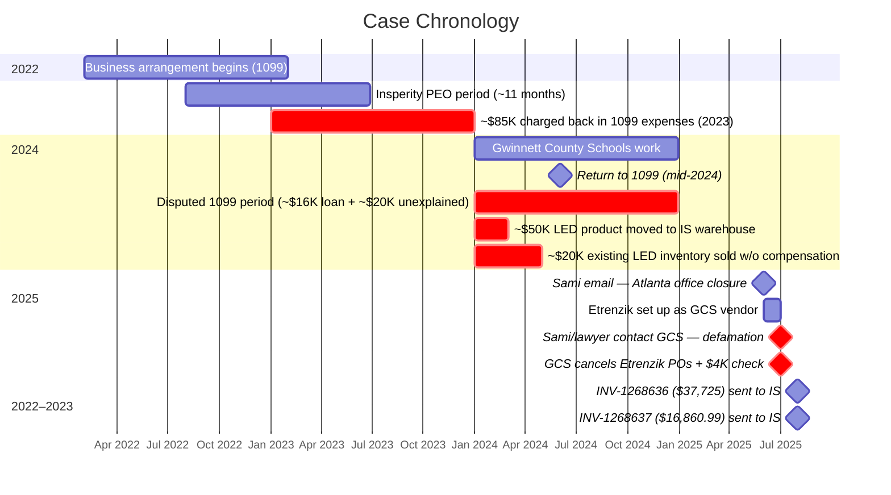
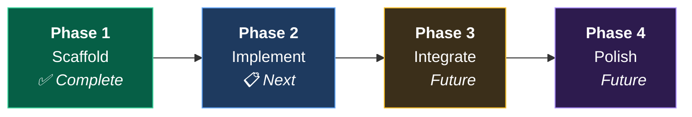
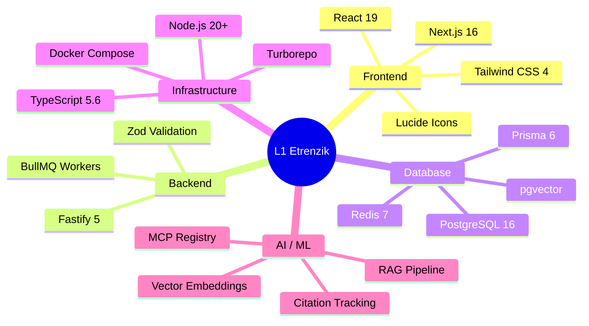

<div align="center">

# ⚖️ Etrenzik LLC v. Inergy Solutions, LLC

### Litigation Workspace & Case Preparation Platform


> 🔴 **DRAFT WORK PRODUCT — NOT LEGAL ADVICE — ATTORNEY REVIEW REQUIRED**
>
> This system is a research and document-preparation workspace. All outputs are drafts.
> Nothing produced by this system constitutes legal advice or a legal opinion.

[](#-development-phases)
[](#license)
[](#prerequisites)

</div>

---

## 📑 Table of Contents

| Section | Description |
|:--------|:------------|
| [🔍 Overview](#-overview) | What this project does and why |
| [🏗️ Architecture](#️-architecture) | System design and data flow |
| [📦 Monorepo Structure](#-monorepo-structure) | Complete workspace layout |
| [🚀 Quick Start](#-quick-start) | Get running in 5 minutes |
| [🧩 Applications](#-applications) | API, Web Dashboard, Workers |
| [📚 Packages](#-packages) | Core libraries and engines |
| [🛠️ MCP Tools](#️-mcp-tools) | Agentic tool registry |
| [⚙️ Workflows](#️-workflows) | Automated case processing pipelines |
| [🗄️ Database Schema](#️-database-schema) | PostgreSQL + pgvector models |
| [🛡️ Guardrails](#️-guardrails) | Safety rules and classification system |
| [📋 Case Context](#-case-context) | Parties, claims, and key events |
| [🔴 Proof Gaps & Red Flags](#-proof-gaps--red-flags) | Evidence still needed |
| [📊 Development Phases](#-development-phases) | Roadmap and progress |
| [📄 Scripts Reference](#-scripts-reference) | All available commands |
| [🏛️ Architecture Decisions](#️-architecture-decisions) | ADR index |
| [📝 Attorney Review Notes](#-attorney-review-notes) | Case-specific legal analysis |

---

## 🔍 Overview

**MCP-based agentic RAG litigation workspace** built as a TypeScript Turborepo monorepo for the civil dispute **Etrenzik LLC v. Inergy Solutions, LLC**.

This platform provides:

| Capability | Status | Description |
|:-----------|:------:|:------------|
| 📄 Document Ingestion | 🟢 Built | Parse PDF, DOCX, EML, XLSX, CSV, images with provenance tracking |
| 🔎 Citation-Preserving RAG | 🟢 Built | Every fact traces back to source document → page → chunk |
| ⏱️ Timeline Reconstruction | 🟢 Built | Chronological event builder with gap/contradiction detection |
| 💰 Invoice Reconciliation | 🟢 Built | Match payments to invoices, compute unpaid balances |
| 📊 Damages Calculation | 🟢 Built | Separate supported vs. speculative damages |
| ⚖️ Legal Issue Spotting | 🟢 Built | Candidate claim identification with evidence mapping |
| 📝 Complaint Drafting | 🟢 Built | Skeleton complaint generation with guardrails |
| 📨 Demand Letter Engine | 🟢 Built | Formal demand template with attorney placeholders |
| 🏦 Tax Dispute Analysis | 🟢 Built | 1099 classification (loan vs. revenue) assessment |
| 🔄 Workflow Orchestration | 🟢 Built | Multi-step case processing with MCP tool chaining |

---

## 🏗️ Architecture

### System Overview



### Request Flow



### Evidence Classification Flow



---

## 📦 Monorepo Structure

```
l1-etrenzik/
│
├── 📱 apps/
│   ├── api/                    # ⚡ Fastify 5 REST API
│   │   ├── src/server.ts       #    Main server entry
│   │   ├── src/config.ts       #    Environment config
│   │   ├── src/middleware/      #    Audit logging
│   │   └── src/routes/         #    cases · documents · timeline
│   │                           #    invoices · workflows · search
│   ├── web/                    # 🖥️ Next.js 16 Dashboard
│   │   ├── src/app/dashboard/  #    9 dashboard pages
│   │   ├── src/components/     #    Navbar · Footer
│   │   └── public/             #    Static assets
│   └── worker/                 # ⚙️ BullMQ Background Workers
│       └── src/index.ts        #    3 concurrent workers
│
├── 📚 packages/
│   ├── core/                   # 🧱 Type system + guardrails
│   │   ├── src/types/          #    evidence · entities · legal
│   │   │                       #    accounting · workflow
│   │   └── src/guardrails.ts   #    Safety rules enforcement
│   ├── db/                     # 🗄️ Prisma ORM + pgvector
│   │   ├── prisma/schema.prisma#    16 database models
│   │   └── prisma/seed.ts      #    Case-specific seed data
│   ├── shared/                 # 🔗 Cross-package utilities
│   ├── mcp/                    # 🧩 MCP Tool Registry
│   │   ├── src/registry.ts     #    Tool registration + validation
│   │   └── src/tools/          #    6 agentic tools
│   ├── rag/                    # 🔎 RAG Pipeline
│   │   ├── src/chunker.ts      #    Paragraph-aware chunking
│   │   ├── src/ingestion.ts    #    Full ingestion pipeline
│   │   └── src/retriever.ts    #    Citation-preserving retrieval
│   ├── workflows/              # 🔄 Workflow Engine
│   │   ├── src/orchestrator.ts #    Step-by-step executor
│   │   └── src/definitions/    #    3 workflow definitions
│   ├── legal-drafting/         # 📝 Document Generation
│   │   ├── src/complaint.ts    #    Complaint skeleton engine
│   │   └── src/demand-letter.ts#    Demand letter template
│   └── accounting/             # 💰 Financial Analysis
│       ├── src/reconciler.ts   #    Invoice reconciliation
│       ├── src/damages.ts      #    Damages computation
│       └── src/tax-dispute.ts  #    1099 classification analysis
│
├── 🏗️ infra/
│   ├── docker-compose.yml      # PostgreSQL + Redis + API + Worker
│   ├── Dockerfile.api          # API container (Node 20 Alpine)
│   └── Dockerfile.worker       # Worker container
│
├── 📖 docs/
│   ├── README.md               # Detailed documentation
│   ├── architecture-decision-record.md  # 6 ADRs
│   └── future-extensions.md    # Phase 2-4 roadmap
│
├── ⚖️ attorney_review_notes/
│   ├── causes-of-action.md     # 7 candidate claims
│   ├── exhibit-list.md         # Preliminary exhibit index
│   ├── proof-gaps.md           # 11 evidence gaps
│   ├── tax-1099-issues.md      # Tax dispute analysis
│   ├── venue-questions.md      # Jurisdiction analysis
│   └── witness-list.md         # Witness list + deposition Qs
│
└── ⚙️ Root Config
    ├── package.json            # Workspaces + Turbo scripts
    ├── turbo.json              # Task pipeline config
    ├── tsconfig.json           # Base TypeScript config
    ├── .env.example            # Environment template
    └── .gitignore              # Monorepo ignore rules
```

---

## 🚀 Quick Start

### Prerequisites

| Requirement | Version | Purpose |
|:------------|:--------|:--------|
| Node.js | ≥ 20.0 | Runtime |
| Docker | Latest | PostgreSQL + Redis |
| npm | ≥ 10.0 | Package manager |

### Setup

```bash
# 1 — Clone the repository
git clone https://github.com/Etrenzik/Sami-Ali-Lawsuit.git
cd Sami-Ali-Lawsuit

# 2 — Install all dependencies
npm install

# 3 — Configure environment
cp .env.example .env
# Edit .env with your credentials

# 4 — Start infrastructure
npm run docker:up

# 5 — Initialize database
npm run db:generate
npm run db:push
npm run db:seed

# 6 — Start all dev servers
npm run dev
```

| Service | URL | Description |
|:--------|:----|:------------|
| 🖥️ Dashboard | `http://localhost:3000` | Attorney workspace UI |
| ⚡ API | `http://localhost:4000` | REST API + Swagger docs |
| 🗄️ PostgreSQL | `localhost:5432` | Database (pgvector enabled) |
| 📮 Redis | `localhost:6379` | Job queue + cache |

---

## 🧩 Applications

### ⚡ API Server (`apps/api`)

REST API built on **Fastify 5** with automatic OpenAPI documentation.

| Endpoint | Method | Description |
|:---------|:------:|:------------|
| `/api/cases` | `GET` `POST` | Case CRUD with jurisdiction tagging |
| `/api/documents` | `GET` `POST` | File upload with UUID naming + provenance |
| `/api/timeline` | `GET` `POST` | Event management with evidence status |
| `/api/invoices` | `GET` `POST` | Invoice tracking + reconciliation summary |
| `/api/workflows` | `GET` `POST` | Workflow definitions + run triggers |
| `/api/search` | `GET` | Keyword + vector search with citations |

**Middleware:** Every response includes `X-Disclaimer: DRAFT WORK PRODUCT` header. All mutations are audit-logged.

### 🖥️ Web Dashboard (`apps/web`)

**Next.js 16** attorney workspace with 9 specialized views:

| Page | Purpose | Features |
|:-----|:--------|:---------|
| 📊 Overview | Case summary | Stat cards, plaintiff/defendant info |
| 📄 Evidence | Document management | Upload UI, document table, format support |
| ⏱️ Timeline | Chronological events | Status badges, participant tracking |
| 💰 Invoices | Financial tracking | Reconciliation summary, 70/30 split |
| ⚖️ Legal Issues | Claim analysis | 6 candidate claims, evidence support levels |
| 📝 Drafts | Document generation | Complaint + demand letter stubs |
| 👥 Witnesses | People management | 4 known persons, deposition question bank |
| 🔄 Workflows | Pipeline execution | 9 definitions (5 ready, 4 stub) |
| 🔴 Red Flags | Risk tracking | 7 flags (3 high, 4 medium severity) |

### ⚙️ Worker (`apps/worker`)

**BullMQ** background job processor with three concurrent worker queues:



---

## 📚 Packages

### 🧱 Core (`packages/core`)

Central type system with **Zod schemas** for runtime validation.

| Type Module | Key Types | Purpose |
|:------------|:----------|:--------|
| `evidence.ts` | EvidenceStatus, JurisdictionTag, DocumentMetadata, Chunk, Citation | Evidence classification + tracking |
| `entities.ts` | Person, Company, Project, Communication, Witness | Domain entity modeling |
| `legal.ts` | Allegation, LegalIssue, DamageItem, FactClassification | Legal concept schemas |
| `accounting.ts` | InvoiceRecord, PaymentRecord, LoanRecord, TaxDisputeRecord | Financial data models |
| `workflow.ts` | WorkflowStep, WorkflowDefinition, WorkflowRunStatus (13 states) | Pipeline definitions |

### 🗄️ Database (`packages/db`)

**Prisma 6** ORM with **pgvector** extension for 1536-dimensional embeddings.



**16 Models:** User · Case · Document · Chunk · Citation · Event · Entity · Invoice · Payment · Loan · TaxRecord · AccountingRequest · Allegation · LegalIssue · Damage · Workflow · WorkflowRun · AuditLog · ReviewComment

### 🔎 RAG Pipeline (`packages/rag`)


| Component | Description |
|:----------|:------------|
| **Chunker** | Paragraph-aware splitting (1000 chars, 200 overlap) |
| **Ingestion Pipeline** | Parse → chunk → store → cite → update provenance |
| **Retriever** | Citation-preserving search with contradiction detection |

---

## 🛠️ MCP Tools

Extensible **Model Context Protocol** tool registry with Zod-validated inputs/outputs.

| Tool | Input | Output | Status |
|:-----|:------|:-------|:------:|
| 📄 `document-ingest` | PDF, DOCX, XLSX, EML, MSG, CSV, TXT, images | Parsed text + metadata + provenance | 🟢 |
| 📧 `email-extract` | EML / MSG file | Sender, recipients, date, body, attachments | 🟢 |
| ⏱️ `timeline-builder` | Events array | Sorted chronology + gap/contradiction flags | 🟢 |
| 💰 `accounting-reconcile` | Invoices + payments | totalInvoiced, totalPaid, unpaidBalance | 🟢 |
| ⚖️ `legal-issue-spotter` | Facts + allegations | Candidate claims with evidence mapping | 🟢 |
| 📝 `complaint-drafter` | Chronology + claims + damages | Complaint skeleton with open issues | 🟢 |

All tool outputs include a `citations[]` array for provenance tracking.

---

## ⚙️ Workflows

### Workflow Orchestration Engine



### Defined Workflows

| # | Workflow | Steps | Purpose |
|:-:|:---------|:-----:|:--------|
| 1 | 📄 **Evidence Intake** | 7 | Parse → metadata → chunk → embed → index → verify |
| 2 | ⏱️ **Timeline Reconstruction** | 5 | Gather → build → gaps → contradictions → output |
| 3 | 💰 **Invoice Reconciliation** | 5 | Gather invoices → payments → reconcile → damages → flag |
| 4 | 🏦 **1099 Classification** | — | Loan vs. revenue analysis *(stub)* |
| 5 | 📊 **Partnership Accounting** | — | P&L demands + split resolution *(stub)* |
| 6 | 🗣️ **Business Interference Memo** | — | Evidence compilation *(stub)* |
| 7 | 📝 **Complaint Draft** | — | Generate complaint skeleton *(stub)* |
| 8 | 📨 **Demand Letter Draft** | — | Generate demand letter *(stub)* |
| 9 | 📎 **Exhibit Binder** | — | Compile numbered exhibits *(stub)* |

---

## 🗄️ Database Schema

### Models at a Glance

| Model | Records | Key Fields | Relationships |
|:------|:-------:|:-----------|:-------------|
| 🔐 **User** | — | email, name, role (4 levels) | → ReviewComments, AuditLogs |
| 📁 **Case** | 1 | plaintiff, defendant, jurisdictions | → Documents, Events, Entities, Invoices, Allegations |
| 📄 **Document** | — | filePath, status, provenance (JSON) | → Chunks |
| 🧩 **Chunk** | — | content, chunkIndex, embedding `vector(1536)` | → Citations |
| 📎 **Citation** | — | excerpt, evidenceStatus | ← Document, Chunk, Event, Allegation |
| 📅 **Event** | 5 | date, participants, status, jurisdictions | → Citations |
| 👤 **Entity** | 5 | type, name, role | ← Case |
| 💰 **Invoice** | 2 | amount (Decimal 12,2), paymentStatus | → Payments |
| 💵 **Payment** | — | amount, payer, payee | ← Invoice |
| 🏦 **Loan** | 1 | amount, repaid, repaymentEvidence | ← Case |
| 📋 **TaxRecord** | 1 | taxYear, formType, classification | ← Case |
| 📨 **AccountingRequest** | 1 | requestType, response status | ← Case |
| ⚖️ **Allegation** | 4 | claim, evidenceStatus, attorneyReviewRequired | → Citations |
| 📜 **LegalIssue** | — | theory, claimType, evidenceSupport | ← Case |
| 💲 **Damage** | 3 | category, amount, supportLevel | ← Case |
| 🔄 **Workflow** | 9 | name, definition (JSON), version | → WorkflowRuns |
| 📋 **AuditLog** | 1 | action, entityType, metadata | ← User |

**Roles:** `ADMIN` · `ATTORNEY` · `REVIEWER` · `CLIENT_VIEW`

---

## 🛡️ Guardrails

### Classification System

| Level | Label | Color | Meaning |
|:-----:|:------|:-----:|:--------|
| 1 | `supported_fact` | 🟢 | Verified by documentary evidence |
| 2 | `user_allegation` | 🟡 | Reported by client — needs corroboration |
| 3 | `inferred_claim` | 🟠 | System-suggested legal theory |
| 4 | `missing_evidence` | 🔴 | Gap identified — proof needed |
| 5 | `legal_conclusion` | ⛔ | Requires attorney sign-off |

### Prohibited Actions

| # | Rule | Enforcement |
|:-:|:-----|:------------|
| 1 | Do not invent contracts or terms | `checkProhibitedContent()` |
| 2 | Do not assert fraud without evidence & attorney approval | Runtime guardrail |
| 3 | Do not assert venue proper without attorney review | Runtime guardrail |
| 4 | Do not characterize 1099 as unlawful without review | Runtime guardrail |
| 5 | Do not assert criminal conduct | `checkProhibitedContent()` |
| 6 | Do not hallucinate citations or false statements | Citation provenance chain |
| 7 | Do not claim defamation as established fact | Evidence status filter |

### Safety Functions

```typescript
assertDisclaimer(text: string)      // Ensures disclaimer is present in output
classifyFact(input: string)         // Returns evidence tier classification
checkProhibitedContent(text: string) // Blocks disallowed patterns
```

---

## 📋 Case Context

### Case Summary

Troy Miller, owner of Etrenzik, LLC, entered into a business arrangement with Inergy Solutions, LLC ("IS") on **February 1, 2022** to continue Etrenzik's existing operations in Georgia and merge its identical LED lighting sales and installation offerings for IS, acting as the CIO/COO. The arrangement was based on an agreed approximately **70/30 profit split** and **$85K in salary** in Etrenzik's favor, with IS covering all expenses (operating, sales, travel, meals/entertainment, etc.).

The relationship started as a **1099 arrangement in February 2022**. For a period of approximately **11 months**, Troy Miller was an employee of **Insperity** as a PEO for Inergy Solutions, then reverted to 1099 in mid-2024. Despite 1099 classification, Mr. Ali operated as if Troy was an employee — paying for laptops, travel, vehicle maintenance, gas, etc. via an IS-supplied credit card.

IS, through its owner Sami Ali, has **failed to pay Etrenzik its agreed share of the revenue split** and the **last 2 weeks of 1099 pay (~$3,270)** after terminating the agreement via email on **June 1, 2025**, totaling an untold amount due to several requests for this information with zero response from Sami Ali or Inergy Solutions.

### Parties

| Role | Entity | Principal | Jurisdiction |
|:-----|:-------|:----------|:------------|
| 🔵 **Plaintiff** | Etrenzik LLC | Troy Miller | Georgia |
| 🔴 **Defendant** | Inergy Solutions, LLC | Sami Ali | Alabama (Huntsville) |

### Key Timeline



### Candidate Claims

| # | Claim | Evidence | Priority |
|:-:|:------|:--------:|:--------:|
| 1 | **Breach of Contract** — Non-payment of revenue split + final 1099 pay (~$3,270) | 🟡 Alleged | 🔴 High |
| 2 | **Account Stated** — June 1 email: "submit invoices so books can be closed and amounts due paid" | 🟢 Partial | 🔴 High |
| 3 | **Unjust Enrichment** — IS retained Etrenzik's share of GCS revenue + unreimbursed inv ($54,585.99) | 🟡 Alleged | 🔴 High |
| 4 | **Tortious Interference** — Sami/lawyer contacted GCS, negated closure, accused Troy of stealing → all POs canceled, $4K check canceled, $750K–$1M future revenue lost | 🟡 Alleged | 🔴 High |
| 5 | **Defamation / Slander Per Se** — Accusation of a crime (stealing/misrepresenting) to GCS | 🟡 Alleged | 🔴 High |
| 6 | **Declaratory Relief** — 1099 reclassification: ~$16K loan as income + ~$20K unexplained expenses | 🟡 Alleged | 🔴 High |
| 7 | **Accounting** — Compel P&L production, detail of ~$85K 2023 1099 charges, revenue split records | 🟡 Alleged | 🔴 High |
| 8 | **Conversion** — ~$50K LED products moved to IS warehouse, never compensated + ~$20K LED inventory sold without compensation | 🟡 Alleged | 🔴 High |
| 9 | **Misclassification / Employment** — IS treated Troy as employee (credit card, equipment, travel) while classifying as 1099 | 🟡 Alleged | 🟡 Medium |

### Financial Summary

| Category | Amount | Status |
|:---------|-------:|:------:|
| Unpaid revenue split (GCS work) | Unknown — IS refuses to provide | 🟡 Alleged |
| Final 1099 pay (last 2 weeks) | ~$3,270 | 🟡 Alleged |
| INV-1268636 (product + labor reimbursement) | $37,725.00 | 🟢 Invoiced 8/1/2025 |
| INV-1268637 (product + labor reimbursement) | $16,860.99 | 🟢 Invoiced 8/1/2025 |
| LED products moved to IS warehouse | ~$50,000 | 🟡 Alleged |
| Existing LED inventory sold w/o compensation | ~$20,000 | 🟡 Alleged |
| Improper 2024 1099 (loan classified as income) | ~$16,000 | 🟡 Alleged |
| Unexplained 2024 1099 expenses | ~$20,000 | 🟡 Alleged |
| 2023 1099 chargebacks (undetailed) | ~$85,000 | 🟡 Alleged |
| GCS canceled check | $4,000 | 🟢 Confirmed |
| Lost GCS annual revenue | $400K–$600K | 🟡 Alleged |
| Lost 12-month future GCS revenue | $750K–$1M | 🟡 Speculative |
| Revenue split understanding | 70/30 | 🟡 Alleged |
| Agreed salary | $85K | 🟡 Alleged |

---

## 🔴 Proof Gaps & Red Flags

### Critical Evidence Needed

| # | Evidence | Impact | Severity |
|:-:|:---------|:-------|:--------:|
| 1 | Written agreement for 70/30 split + $85K salary | Breach of contract claim depends on it | 🔴 **HIGH** |
| 2 | Revenue split accounting from IS | Unable to calculate total owed — IS refuses to provide | 🔴 **HIGH** |
| 3 | Loan documentation (~$16K) | Critical for 1099 dispute | 🔴 **HIGH** |
| 4 | Detail of ~$85K 2023 1099 chargebacks | IS has never provided accounting | 🔴 **HIGH** |
| 5 | Detail of ~$20K unexplained 2024 1099 expenses | IS has never provided accounting | 🔴 **HIGH** |
| 6 | GCS witness statements re: defamation/slander | Corroborates interference + slander per se | 🔴 **HIGH** |
| 7 | Documentation of ~$50K LED products moved to IS warehouse | Supports conversion claim | 🟡 **MED** |
| 8 | Documentation of ~$20K LED sold w/o compensation | Supports conversion claim | 🟡 **MED** |
| 9 | GCS PO records (open + canceled) | Quantifies tortious interference damages | 🟡 **MED** |
| 10 | P&L request documentation | Supports accounting claim + IS refusal | 🟡 **MED** |
| 11 | Insperity PEO employment records | Supports misclassification claim | 🟡 **MED** |

### Red Flags

| Flag | Severity | Concern |
|:-----|:--------:|:--------|
| No written contract for split/salary | 🔴 High | Breach claim relies on oral agreement |
| IS refuses to provide accounting | 🔴 High | Total damages cannot be calculated |
| 1099 loan claim undocumented | 🔴 High | Without proof, classification stands |
| Gwinnett defamation — slander per se | 🔴 High | Accusation of crime (stealing) to third parties |
| ~$85K unexplained 2023 1099 charges | 🔴 High | Significant tax liability with no supporting detail |
| GCS business relationship destroyed | 🔴 High | $400K–$600K annual + $750K–$1M future revenue lost |
| Jurisdiction complexity (GA/AL/Fed) | 🟡 Med | Multi-forum litigation risk |
| Employee vs. 1099 misclassification | 🟡 Med | IS controlled manner of work (credit card, equipment) |
| PO transfer difficulties at GCS | 🟡 Med | End-of-year set-aside classification complicates transfer |
| IS may counter-claim re: POs worked | 🟡 Med | Troy continued 2 POs outside Ali's stated list |
| Partnership characterization unclear | 🟡 Med | JV vs. contractor vs. partnership affects claims |

---

## 📊 Development Phases



| Phase | Status | Deliverables |
|:------|:------:|:-------------|
| **Phase 1 — Scaffold** | ✅ Complete | Monorepo, Prisma schema, seed data, Docker infra, 9 dashboard pages, all packages |
| **Phase 2 — Implement** | 📋 Next | MCP tool wiring, vector search, LLM integration, BullMQ ↔ MCP, DB persistence |
| **Phase 3 — Integrate** | 🔮 Future | Complaint drafting + LLM, exhibit compilation, discovery generator, deposition expansion |
| **Phase 4 — Polish** | 🔮 Future | Real-time search, drag-drop upload, red flag dashboard, timeline viz, attorney review queue |

---

## 📄 Scripts Reference

| Command | Description |
|:--------|:------------|
| `npm run dev` | Start all apps in development mode |
| `npm run build` | Build all packages and apps |
| `npm run lint` | Lint all workspaces |
| `npm run test` | Run all test suites |
| `npm run clean` | Remove all build artifacts + node_modules |
| `npm run db:generate` | Generate Prisma client |
| `npm run db:push` | Push schema to database |
| `npm run db:migrate` | Run database migrations |
| `npm run db:seed` | Seed database with case data |
| `npm run docker:up` | Start PostgreSQL + Redis containers |
| `npm run docker:down` | Stop infrastructure containers |

---

## 🏛️ Architecture Decisions

| ADR | Title | Decision |
|:---:|:------|:---------|
| 001 | **Turborepo Monorepo** | npm workspaces with cached, incremental builds |
| 002 | **PostgreSQL + pgvector** | Single database for relational + vector data |
| 003 | **MCP Tool Registry** | Extensible tools with Zod schema validation |
| 004 | **Citation-Preserving RAG** | Every chunk carries document → page → excerpt provenance |
| 005 | **Evidence Status Classification** | Three-tier: `confirmed` · `alleged` · `speculative` |
| 006 | **Guardrail System** | Centralized safety — no legal advice, no predictions |

Full details: [`docs/architecture-decision-record.md`](docs/architecture-decision-record.md)

---

## 📝 Attorney Review Notes

| Document | Contents |
|:---------|:---------|
| [`venue-questions.md`](attorney_review_notes/venue-questions.md) | Jurisdiction analysis · GA/AL/Federal contacts · 5 open questions |
| [`causes-of-action.md`](attorney_review_notes/causes-of-action.md) | 7 candidate claims with elements checklists + evidence gaps |
| [`proof-gaps.md`](attorney_review_notes/proof-gaps.md) | 11 evidence gaps prioritized by severity |
| [`witness-list.md`](attorney_review_notes/witness-list.md) | 4 known persons + 19 deposition questions for Sami Ali |
| [`exhibit-list.md`](attorney_review_notes/exhibit-list.md) | Preliminary exhibit index (2 in system, 12 needed) |
| [`tax-1099-issues.md`](attorney_review_notes/tax-1099-issues.md) | 1099 dispute analysis + tax counsel review questions |

---

## 🔧 Tech Stack



---

<div align="center">

### License

**Private** — Etrenzik LLC. All rights reserved.

---

> 🔴 **DRAFT WORK PRODUCT — NOT LEGAL ADVICE — ATTORNEY REVIEW REQUIRED**

Built with precision by **Etrenzik Engineering**

</div>
